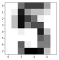
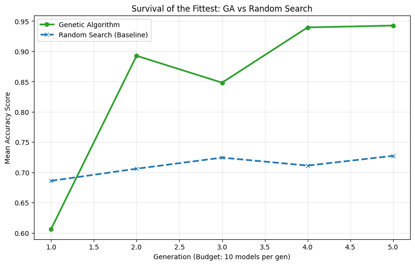

Survival of the fittest isn't just a rule for the jungle; it’s a blueprint for building better machine learning models.

A growing trend in data science involves translating natural phenomena into code, giving us tools like Particle Swarm and Ant Colony Optimization. But one of the most practical applications of this bio-mimicry is the **Genetic Algorithm** (GA).

In this tutorial, I will show you how to 'evolve' hyperparameters like DNA sequences. By simulating natural selection, we can move away from the inefficiency of RandomSearch and GridSearch methods and learn to evolve our models toward higher accuracy.

## The Biology of Data Science

Before we write any code, we need to establish our vocabulary. In a Genetic Algorithm, we map biological concepts directly to Python objects.

| Genetic Term | Programming Definition |
|:-----------------------------------|:-----------------------------------|
| **Individual** | A single model instance (e.g., a Random Forest) with specific hyperparameters. |
| **Chromosome** | The dictionary of hyperparameters for that model (e.g., `{'max_depth': 10}`). |
| **Gene** | A single hyperparameter and its value. |
| **Fitness Score** | The accuracy of the model (measured via Cross Validation). |
| **Population** | The list of all models currently alive in a generation. |
| **Gene Pool** | The search space of all possible hyperparameter values. |

For this demonstration, we will be tuning a **Random Forest Classifier**. While previous tutorials have applied this to SVMs or Decision Trees, the Random Forest is robust enough to show how evolution can optimize even complex ensemble models.

## Setting the Stage: Genesis

To truly test our algorithm, we are going to make the problem hard. I will be using the **Digits dataset** as a classification problem to predict the labels of the images in the dataset, which depict different handwritten digits:



We will "poison" the gene pool with many suboptimal choices (like trees with a depth of only 1). This forces the algorithm to work hard to find the good parameters. We will also split the data to obtain an unusually large test size (80%) as the Digits dataset is unrealistically clean and will make it difficult to observe the effect of each hyperparameter change.

```{python}
#| label: setup
import numpy as np
from sklearn.model_selection import train_test_split
from sklearn.ensemble import RandomForestClassifier
from sklearn import metrics
import random
from sklearn.model_selection import cross_validate
from sklearn.datasets import load_digits

#Load the data and split
digits = load_digits()

X = digits.data
y = digits.target

X_train, X_test, y_train, y_test = train_test_split(X, y, test_size = 0.8, random_state = 542)

#Create the Gene Pool

GENE_POOL = {
    'n_estimators': [1, 2, 5, 10, 50, 100],
    'max_depth': [1, 2, 5, 10, 15, 20], 
    'min_samples_split': [2, 5, 10], 
    'criterion': ['gini', 'entropy']
}
```

## The Biological Functions

We need three key functions to simulate nature: **Crossover** (breeding), **Mutation** (random variation), and **Fitness** (evaluation).

### Crossover

Genetic crossover consists of selecting gene inheritance from one of the two parents. In this case, we will be selecting the value for each hyperparameter of the child model based on 50/50 chance from each parent. This function loops through every hyperparameter it can inherit from a parent and selects the value from either model A or model B to give to the child model.

```{python}
#| label: crossover-function
def crossover(parent_1, parent_2):
    """
    Mixes genes (hyperparameters) from two parents to create a child.
    """
    child = {}
    
    # Iterate through every hyperparameter gene
    for key in GENE_POOL.keys():
        
        # 50% chance to inherit from Parent 1, 50% from Parent 2
        if random.random() > 0.5:
            child[key] = parent_1[key]
        else:
            child[key] = parent_2[key]
            
    return child
```

### Mutation

Mutation ensures that we do not get stuck with the same genes we started with, and that there is a chance of randomly adding a better hyperparameter value to the gene pool. This function loops through each hyperparameter value, and with a mutation rate of 10%, can randomly select a new value from the original gene pool.

```{python}
#| label: mutation-function
def mutate(individual, mutation_rate=0.1):
    """
    Randomly changes one gene to maintain diversity.
    """
    for key in individual.keys():
        
        # 10% chance to mutate this specific gene
        if random.random() < mutation_rate:
            
            # Pick a new random value from the global GENE_POOL
            new_value = random.choice(GENE_POOL[key])
            individual[key] = new_value
            
    return individual
```

### Fitness

We must assess the survival fitness of each model (using 'accuracy' as a metric) so that the best models can be selected for.

```{python}
#| label: fitness-function
def fitness_function(individual):
    """
    Builds a Random Forest using the 'individual's' genes 
    and calculates the accuracy.
    """
    model = RandomForestClassifier(
        n_estimators=individual['n_estimators'],
        max_depth=individual['max_depth'],
        min_samples_split=individual['min_samples_split'],
        criterion=individual['criterion'],
        random_state=542
    )

    scores = cross_validate(model, X_train, y_train, cv=5, scoring='accuracy')

    
    return scores['test_score'].mean()
```

## Survival of the Fittest

Now for the main event. We need a loop that runs for several generations. This function simulates a full evolution across 5 generations, beginning with an original population of models. It first assesses the fitness of the current population (using both the best score and the average score of that generation), then selects for the top 20% of models. This is to recreate the natural rule of ‘survival of the fittest’. That top 20% will then undergo genetic crossover to create a child model, which may then experience genetic mutation. Once the next generation has been populated with the same number of models as the previous generation, the evolution runs again.

In short, we:

1.  Evaluate all models.
2.  Kill the weak ones.
3.  Breed the survivors to fill the population back up.

```{python}
#| label: evolution-loop

def run_generation(population):
    """
    Runs one generation of the evolutionary process.
    """
    scores = []
    for individual in population:
        score = fitness_function(individual)
        scores.append((score, individual))
        
    
    scores.sort(key=lambda x: x[0], reverse=True)

    scores_only = [x[0] for x in scores]
    avg_score = sum(scores_only) / len(scores_only)

    best_score = scores_only[0]
    print(f"Best: {best_score:.4f} | Avg: {avg_score:.4f} | Best Params: {scores[0][1]}")
    
    sorted_population = [x[1] for x in scores]
    top_parents = sorted_population[:len(population)//5]

    next_gen = []

    next_gen.append(top_parents[0])

    while len(next_gen) < len(population):
        parent_a = random.choice(top_parents)
        parent_b = random.choice(top_parents)
        child = crossover(parent_a, parent_b)
        child = mutate(child)
        next_gen.append(child)
        
    return next_gen
```

## The Results

Let's run the simulation for 5 generations with a population of 10 models.

```{python}
#| label: run-experiment

# Step 1: Genesis (Create random initial population)
population = []
for _ in range(10):
    random_creature = {k: random.choice(v) for k, v in GENE_POOL.items()}
    population.append(random_creature)

# Step 2: Evolve
for i in range(5):
    print(f"--- Generation {i+1} ---")
    population = run_generation(population)
```

**Output:**

``` markdown
--- Generation 1 ---
Best: 0.9359 | Avg: 0.6064 | Best Params: {'n_estimators': 50, 'max_depth': 10, 'min_samples_split': 2, 'criterion': 'gini'}
--- Generation 2 ---
Best: 0.9387 | Avg: 0.8927 | Best Params: {'n_estimators': 50, 'max_depth': 20, 'min_samples_split': 2, 'criterion': 'entropy'}
--- Generation 3 ---
Best: 0.9442 | Avg: 0.8482 | Best Params: {'n_estimators': 100, 'max_depth': 10, 'min_samples_split': 2, 'criterion': 'gini'}
--- Generation 4 ---
Best: 0.9442 | Avg: 0.9395 | Best Params: {'n_estimators': 100, 'max_depth': 10, 'min_samples_split': 2, 'criterion': 'gini'}
--- Generation 5 ---
Best: 0.9442 | Avg: 0.9426 | Best Params: {'n_estimators': 100, 'max_depth': 10, 'min_samples_split': 2, 'criterion': 'gini'}
```

We can see that the initial generation has a pretty low average fitness score (0.6064), but as the models evolve into each subsequent generation and select for the better 'genes', the average fitness scores steadily increase until the average performance across all models within a generation is pretty much equal to the best performing model (0.9426).

We did end up with a well-performing model, but is this better than Scikit Learn's `RandomizedSearchCV`? Let's investigate!

## Genetic Algorithm vs. Random Search

I will create and tune Random Forest models with the same computational budget (50 models), using Random Search:

```{python}
#| label: run-randomcv

from sklearn.model_selection import RandomizedSearchCV

n_iter = 50
rs = RandomizedSearchCV(
    RandomForestClassifier(random_state=42),
    param_distributions=param_dist,
    n_iter=n_iter,
    cv=5,
    scoring='accuracy',
    n_jobs=-1,
    random_state=42
)
#fit the model
rs.fit(X_train, y_train)

rs_results = rs.cv_results_['mean_test_score']
rs_avg_cumulative = []

#gather fitness scores for 50 models, in batches of 10
for i in range(1, 6):

    batch = rs_results[:i*10]
    rs_avg_cumulative.append(np.mean(batch))
```

In order to visually compare the performance of both models, I plotted the average fitness scores for each generation of models (10 at a time) across 5 generations:

```{python}
#| label: plot-comparison

import matplotlib.pyplot as plt

#hardcoded the GA scores in, may vary between runs
ga_generations = [1, 2, 3, 4, 5]
ga_scores = [0.6064, 0.8927, 0.8482, 0.9395 , 0.9426]

plt.figure(figsize=(10, 6))


plt.plot(ga_generations, ga_scores, marker='o', label='Genetic Algorithm', 
         color='#2ca02c', linewidth=2.5)


plt.plot(ga_generations, rs_avg_cumulative, marker='x', linestyle='--', 
         label='Random Search (Baseline)', color='#1f77b4', linewidth=2.5)

plt.title('Survival of the Fittest: GA vs Random Search')
plt.xlabel('Generation (Budget: 10 models per gen)')
plt.ylabel('Mean Accuracy Score')
plt.legend()
plt.grid(True, alpha=0.3)
plt.show()
```



## The Verdict: Does Evolution Work?

After running our genetic simulation against the "blind luck" of Random Search, the results tell a clear story.

While Random Search initially found a decent mode, it quickly hit a ceiling. It had no mechanism to "learn" from its previous guesses. It just kept guessing blindly.

In contrast, our Genetic Algorithm displayed **evolution**:

1\. **Early Struggle:** In the first few generations, it struggled with the "poisoned" gene pool, leading to a lower score.

2\. **Rapid Adaptation:** Once it identified the robust genes, it propagated them.

3\. **Optimization:** Through mutation, it fine tuned those robust models and converged on a top score.

### Key Takeaways

-   **Efficiency:** GA reached a higher accuracy plateau using the exact same computational budget (50 model fits) as Random Search.
-   **Robustness:** Even when we flooded the gene pool with "bad" options, evolution successfully filtered them out.
-   **Flexibility:** While we used a Random Forest here, this exact logic applies to Neural Networks (Neuroevolution) or any other complex system where the "best" answer isn't obvious.

### Final Thought

Bio-inspired algorithms remind us that we don't always need to brute-force our way to a solution. Sometimes, we just need to set the right constraints, introduce a little randomness, and let nature take its course.
